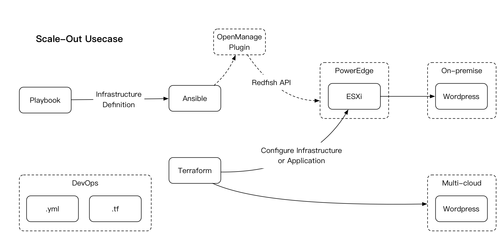
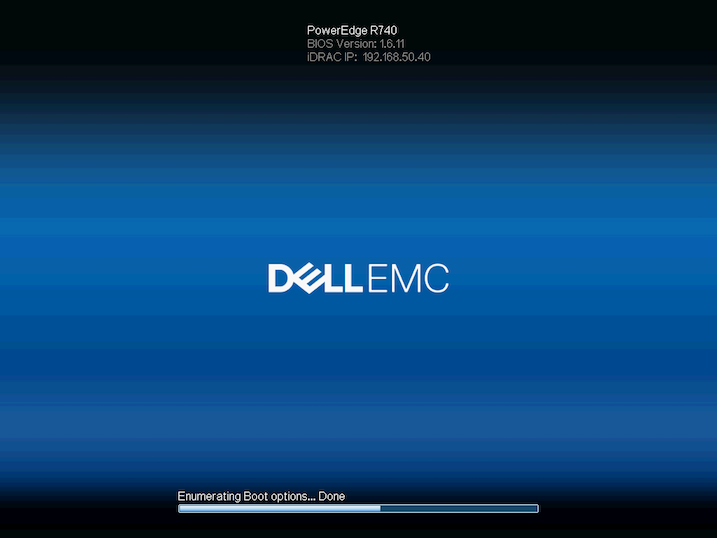

# nunchuk/infra-as-code:v1

- [Introduction](#introduction)
- [Getting started](#getting-started)
	- [Demo #1 - Play with Ansible](#demo-1-play-with-ansible)
		- [What is Ansible](#what-is-ansible)
		- [Ansible Step-by-step](#ansible-step-by-step)
			- [1. Configuring iDRAC9 IP address on PowerEdge 14G](#1-configuring-idrac9-ip-address-on-poweredge-14g)
			- [2. Customize HostOS Image File](#2-customize-hostos-image-file)
			- [3. Preparing Ansible Environment](#3-preparing-ansible-environment)
			- [4. Preparing NFS service](#4-preparing-nfs-service)
			- [5. Deploy Operation System from Network Share](#5-deploy-operation-system-from-network-share)
	- [Demo #2 - Play with Terraform](#demo-2-play-with-terraform)
		- [What is Terraform](#what-is-terraform)
		- [Terraform Step-by-step](#terraform-step-by-step)
			- [1. Create your kick start template](#1-create-your-kick-start-template)
			- [2. Preparing Terraform Envionment](#2-preparing-terraform-envionment)
			- [3. Clone VMs from Ubuntu Template](#3-clone-vms-from-ubuntu-template)
			- [4. Deploy WordPress](#4-deploy-wordpress)
			- [5. App lifecycle Mgmt](#5-app-lifecycle-mgmt)
- [Known Issues](#known-issues)

# Introduction

Use open source tools (Ansible & Terraform in this case) and some scripts to call Dell EMC hardware resources (e.g. PowerEdge 14G Server) and hypervisor platforms (e.g. vSphere) for operation system initialization and application deployment.



# Getting started

## Demo #1 - Play with Ansible

### What is Ansible

Ansible is an open-source software

- Configure systems
- Deploy software
- Orchestrate advanced IT tasks like
 * Continuous deployments
 * Zero downtime rolling updates

### Ansible Step-by-step

#### 1. Configuring iDRAC9 IP address on PowerEdge 14G

`192.168.50.40` in this case

#### 2. Customize HostOS Image File

1. Download ESXi disc image `VMware-VMvisor-Installer-6.7.0.update01-10764712.x86_64-DellEMC_Customized-A03.iso`

2. Edit `/ansible/os_images/esxi/KS_CUST.CFG`, change password and IP address settings compatible your environment

3. Use `UltraISO` to open ESXi disc image file, copy `BOOT.CFG` `KS_CUST.CFG` to ISO file root folder and replace the same name files.

4. Use `UltraISO` save as new file `Cust_v1_VMware-VMvisor-Installer-6.7.0.update01-DellEMC_Customized-A03`

#### 3. Preparing Ansible Environment

1. Install Ansible

`ansible 2.7.10` in this case

2. Install Python

`python 2.7.6`

3. Install Dell EMC OpenManage Python SDK

`omsdk 1.2.345`

[https://github.com/dell/omsdk](https://github.com/dell/omsdk)

4. Install Dell EMC OpenManage Ansible Modules

`v2.0`

[https://github.com/dell/dellemc-openmanage-ansible-modules](https://github.com/dell/dellemc-openmanage-ansible-modules)

5. Verify your installation

```bash
$ ansible-playbook --verion
ansible-playbook 2.7.10
  config file = /etc/ansible/ansible.cfg
  configured module search path = [u'/root/.ansible/plugins/modules', u'/usr/share/ansible/plugins/modules']
  ansible python module location = /usr/lib/python2.7/dist-packages/ansible
  executable location = /usr/bin/ansible-playbook
  python version = 2.7.6 (default, Nov 13 2018, 12:45:42) [GCC 4.8.4]
```

6. (Optional) Using Pre-configured Docker Container

> Need you already have some knowledge of Docker.

```bash
$ docker run --rm -ti nunchuk/ansible:openmanage-2.0
ansible-playbook 2.7.10
```

#### 4. Preparing NFS service

1. Copy your customized ESXi disc image file to NFS shared folder

`192.168.130.74` is the NFS server IP

2. Verify your NFS server

```bash
$ mount 192.168.130.74:/ /mnt
$ ls /mnt
Cust_v1_VMware-VMvisor-Installer-6.7.0.update01-DellEMC_Customized-A03.iso
```

#### 5. Deploy Operation System from Network Share

1. Add a host group into Ansible

```bash
$ { echo '[poweredge]'; echo '192.168.50.40'; } >> /etc/ansible/hosts && cat /etc/ansible/hosts
localhost
[poweredge]
192.168.50.40
```

2. Check the PowerEdge LifeCycle status

```
$ ansible-playbook dellemc_get_lcstatus.yml -v
Using /etc/ansible/ansible.cfg as config file
/etc/ansible/hosts did not meet host_list requirements, check plugin documentation if this is unexpected
/etc/ansible/hosts did not meet script requirements, check plugin documentation if this is unexpected

PLAY [Check LC Ready Status] *****************************************************************************************

TASK [Check LC Ready Status] *****************************************************************************************
ok: [192.168.50.40] => {"changed": false, "msg": {"LCReady": true, "LCStatus": "Ready"}}

PLAY RECAP ***********************************************************************************************************
192.168.50.40              : ok=1    changed=0    unreachable=0    failed=0
```

3. Deploy ESXi by Ansible

```
$ ansible-playbook dellemc_deploy_os.yml -v
Using /etc/ansible/ansible.cfg as config file
/etc/ansible/hosts did not meet host_list requirements, check plugin documentation if this is unexpected
/etc/ansible/hosts did not meet script requirements, check plugin documentation if this is unexpected

PLAY [Booting to Network Operating System image] *********************************************************************

TASK [Deploy Operating System From A Remote Network Share] ***********************************************************
changed: [192.168.50.40] => {"changed": true, "msg": {"DeleteOnCompletion": "false", "InstanceID": "DCIM_OSDConcreteJob:1", "JobName": "BootToNetworkISO", "JobStatus": "Success", "Key": "<null_index>", "Message": "The command was successful.", "MessageID": "OSD1", "Name": "BootToNetworkISO", "Status": "Success", "file": "192.168.130.74://Cust_v1_VMware-VMvisor-Installer-6.7.0.update01-DellEMC_Customized-A03.iso", "retval": true}}

PLAY RECAP ***********************************************************************************************************
192.168.50.40              : ok=1    changed=1    unreachable=0    failed=0
```

You can monitoring the process from iDRAC web console, the Ansible will doing a installation and reboot automatically via calling **Redfish API**, _no manual action required_.



## Demo #2 - Play with Terraform

### What is Terraform

Terraform is an open-source tool

- Build, change, version infrastructure through a common config file
- One command to create, update infrastructure
- Supports many providers
 * AWS, Azure, GCP, Digital Ocean
 * VMware vSphere, vCloud Director

### Terraform Step-by-step

#### 1. Create your kick start template

1. Prerequisite:
 - Ubuntu Server 14.04/16.04
 - OpenSSH service with root account
 - Network DHCP

2. Login vCenter `v6.7`, convert preconfigured virtual machine to template. Template named `Ubuntu_1604_noDocke` in this case.

#### 2. Preparing Terraform Envionment

1. Install Terraform

`Terraform v0.11.13`

[https://learn.hashicorp.com/terraform/getting-started/install.html](https://learn.hashicorp.com/terraform/getting-started/install.html)

2. Verify your installation

```bash
$ terraform -version
Terraform v0.11.13
```

3. (Optional) Using Pre-configured Docker Container

> Need you already have some knowledge of Docker.

```bash
$ docker run --rm -ti nunchuk/terraform:0.11.13 terraform -version
Terraform v0.11.13
```

#### 3. Clone VMs from Ubuntu Template

- _Change the parameters in `vars.tf` to your own username and password_
- _Change the parameters in `instance.tf` to compatible with your vsphere resources_

```
$ cd infra-as-code/terraform/ubuntu

$ terraform init

$ terraform plan  \
  -var 'vmcount=3'

$ terraform apply \
  -var 'vmcount=3'
```

At this point, the vCenter will clone 3 VMs automatically.

#### 4. Deploy WordPress

Getting a IP address from one of the three VMs you just created. `192.168.130.69` in this case.

```
$ cd infra-as-code/terraform/wordpress

$ terraform init

$ terraform apply \
 -var 'host=192.168.130.69'

$ terraform destroy \
 -var 'host=192.168.130.69'
```

At this point, the Terraform will Install Docker and download the docker images then bring-up via SSH.

Open a browser to access `http://192.168.130.69`

#### 5. App lifecycle Mgmt

For application lifecycle management, we need to maintain the consistency of the environment, the best way is to recreate the environment every time the version is updated.

```
$ cd infra-as-code/terraform/wordpress

$ terraform destroy \
 -var 'host=192.168.130.69'

$ cd infra-as-code/terraform/ubuntu

$ terraform destroy \
  -var 'vmcount=3'
```

# Known Issues

- LC status is always `IN USE` after the Installation
